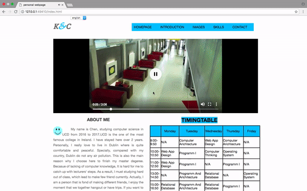
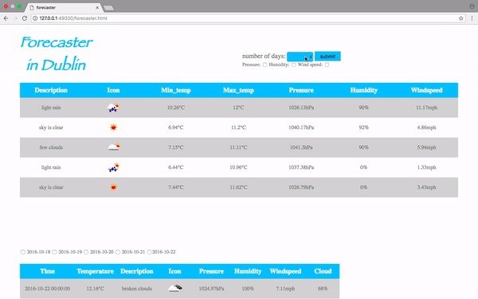
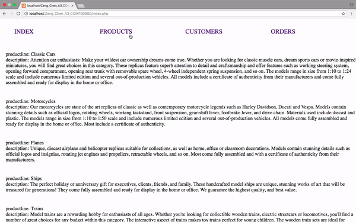

# web-application

## Assignment1: Create own website usign HTML5 and CSS:

## Assignment2: 
Creat a web app to display dublin 5 days weather infor by using JavaScript.

## Assignment3: 
focuses on the use of PHP to manipulate data from MySQL databases.
create a website that uses PHP, HTML, CSS and JavaScript to display information from the classicmodels database. Using XAMPP for web server environmment. And included error handling.
For example,be able to recover and respond appropriately when a database connection fails or when a query fails and causes an error.

